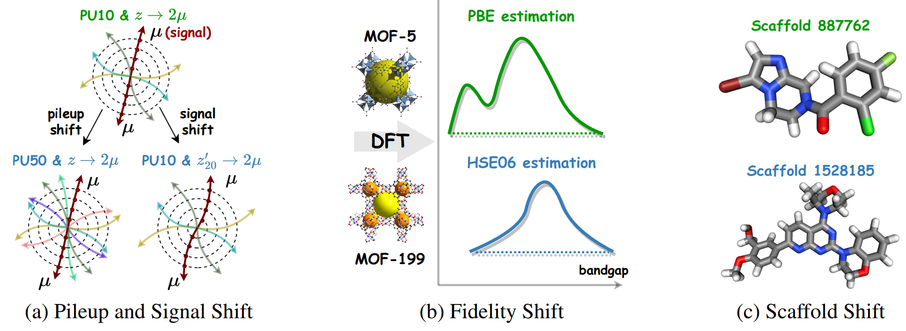

# GeSS: Benchmarking Geometric Deep Learning under Scientific Applications with Distribution Shifts

This repository contains the official implementation of GeSS as described in the paper (under review of NeurIPS 2024 Datasets and Benchmarks Track)
*GeSS: Benchmarking Geometric Deep Learning under Scientific Applications with Distribution Shifts* by Deyu Zou, Shikun Liu, Siqi Miao, Victor Fung, Shiyu Chang, and Pan Li.

## Table of Contents

* [Overview](#overview)
* [Features](#Features)
* [Dataset Introduction](#Dataset-Introduction)
* [Installation](#Installation)
* [Quick Tutorial -- Reproducing Results](#Quick-Tutorial----Reproducing-Results)
* [Quick Tutorial -- Adding new components to extend this benchmark](#Quick-Tutorial----Adding-new-components-to-extend-this-benchmark)

## Overview

We propose **GeSS**, a comprehensive benchmark designed for evaluating the performance of geometric deep learning (GDL) models in scenarios where scientific applications encounter distribution shift challenges. Our evaluation datasets cover diverse scientific domains from particle physics and materials science to biochemistry, and encapsulate a broad spectrum of distribution shifts including conditional, covariate, and concept shifts. Furthermore, we study three levels of information access from the out-of-distribution (OOD) testing data, including no OOD information (No-Info), only OOD features without labels (O-Feature), and OOD features with a few labels (Par-Label).

## Features

Besides the points mentioned in the Intro section of our paper, our benchmark has the following features:

- **Easy-to-use**. As shown in `GESS.core.main:main`, GeSS provides simple APIs with only *a few lines of codes* to load necessary components like scientific datasets, GDL encoders, ML models, learning algorithms. It also provides a clear and unified pipeline for model training and evaluation processes. Quick using tutorials can be seen in the following sections.
- **Easy-to-extend**. Besides serving as a package, GeSS is ready for further development. We apply a global `register` for unified GDL backbones, models, datasets, algorithms, and running pipelines access. Newly designed algorithms can be easily mounted to the global Register using just a Python decorator @. All you need is to inherit the base class and focus on the design of the novel component.
- **Co-design of GDLs and learning algos**. Quick tutorials of how to add new GDL backbones and learning algorithms are shown in the following sections. With allowing co-design of GDLs and learning algos, this benchmark attempts to bridge the gap between the GDL and distribution-shift community.

## Dataset Introduction

Figure 1 provides illustrations of some distribution shifts mentioned in this paper. Dataset statistics could be found in our paper. **All processed datasets are available for manual download from** [Zenodo](https://zenodo.org/records/10070680) (Here is another [upload](https://zenodo.org/records/10012747) due to the space limit). For the HEP dataset, we highly recommend using the processed files directly because the raw files would consume a significant amount of disk space and require a longer time for processing. Regarding DrugOOD-3D, in this paper, we utilized three cases of distribution shifts, including `lbap_core_ic50_assay`, `lbap_core_ic50_scaffold`, `lbap_core_ic50_size`,  and we recommend readers to find more details in https://github.com/tencent-ailab/DrugOOD. As for QMOF, our data is sourced from https://github.com/Andrew-S-Rosen/QMOF. For more details of our datasets, please check Appendix C of the paper.

<p align="center"></p>
<p align="center"><em>Figure 1.</em> Illustrations of the four scientific datasets in this work to study interpretable GDL models. </p>

## Installation

We have tested our code on `Python 3.9` with `PyTorch 1.12.1`, `PyG 2.2.0` and `CUDA 11.3`. Please follow the following steps to create a virtual environment and install the required packages.

Step 1: **Clone the repository**

```
git clone https://github.com/Graph-COM/GESS.git
cd GESS
```

Step 2: **Create a virtual environment**

```
conda create --name GESS python=3.9 -y
conda activate GESS
```

Step 3: **PyTorch 1.12.1, PyG 2.2.0, CUDA 11.3**

```
conda install -y pytorch==1.12.1 torchvision==0.13.1 torchaudio==0.12.1  cudatoolkit=11.3 -c pytorch
pip install torch-scatter==2.1.0 torch-sparse==0.6.16 torch-cluster==1.6.0 torch-geometric==2.2.0 -f https://data.pyg.org/whl/torch-1.12.0+cu113.html
```

Step 4: **Installation for Project usages**

```
pip install -e .
```

## Quick Tutorial -- Reproducing Results

Here, we provide the CLI `gess-run` to access the main function located at `GESS.core.main:main` to reproduce our experimental results at convenience. Two arguments `--config_path` (specify datasets & dhifts & algorithms & Information level) and `--gdl` (specify GDL backbones) are required.

```
gess-run --config_path [dataset]/[shift]/[target]/[info_level]/[algo].yaml --gdl [GDL]
```

Here we list applicable choices in this benchmark and we introduce how to add new algorithms, shifts or GDL backbones in the following sections.

- `[dataset]`: Name of the dataset, which can be chosen from `Track`, `DrugOOD_3D`, and `QMOF`, and the dataset specified will be downloaded automatically.
- `[shift]` and `[target]`: Name of the distribution shift and the specific shift case.
- `[info_level]` and `[algo]`: Information Level and its corresponding learning algorithms proposed in this paper, which can be chosen from `No-Info` (algorithms of `ERM`, `LRI`, `Mixup`, `DIR`, `GroupDRO`, `VREx`), `O-Feature` (algorithms of `Coral`, `DANN`) and `Par-Label` (algorithms of `TL_100`, `TL_500` and `TL_1000`).
- `[GDL]`: Name of GDL backbone, which can be chosen from `dgcnn`, `pointtrans` and `egnn`.

Here are some examples:

```
# example 1
gess-run --config_path Track/signal/zp_10/No-Info/ERM.yaml --gdl egnn

# example 2
gess-run --config_path DrugOOD_3D/size/lbap_core_ic50_size/O-Feature/DANN.yaml --gdl dgcnn
```

## Quick Tutorial -- Adding new components to extend this benchmark

### 1. Add New Learning Algorithms

Firstly consider the following three questions before adding new learning algorithms:

- Does the algo need additional *modules*?
  The default ML model in this project has one **GDL** encoder (used to process and encode geometric data) and one **MLP** (used to produce model outputs). If your algorithm uses additional modules for specific needs (*e.g.,* DANN needs an additional domain discriminator and gradient reverse layer), take care in **step1**.
- Does the algo need specific *optimization strategy*?
- Does the algo need specific *criterion* besides cross entropy and MSE?

Now we introduce the following 4 steps to add your new algorithm to this benchmark.

1. **Build the ML model**.

   - In our benchmark, a learning algorithm calculates losses by manipulating various modules (including GDL, MLP or more) of the ML model. So it's important to build your ML model before algorithm implementation.
   - If your algo does not need additional modules, using our `BaseModel` (*GESS/models/models/base_model.py*) is fine.
   - If your algo requires additional modules, inherit `BaseModel` to specify a new one. Also you can add additional methods for specific needs of producing data. Refer to *GESS/models/models/DIR_model.py* for an example.
2. **Build the learning algorithm**.

   - In the *GESS/algorithms/baselines* folder, copy an algorithm file as a reference and rename it as as `new_algo.py`.
   - Inherit the `BaseAlgo` class (*GESS/algorithms/baselines/base_algo.py*) to add new learning algorithms.
   - Specify `self.setup_criterion()` method if the algo need specific criterion beyond default setup. Refer to *GESS/algorithms/baselines/VREx.py* for an example.
   - Specify `self.setup_optimizer()` (used to setup optimizer) and `self.loss_backward()` (used to optimize loss objectives) method if the algo need specific optimization strategy beyond default setup. Refer to *GESS/algorithms/baselines/DIR.py* for an example.
   - Specify `self.forward_pass()`, which is used to manipulate modules of `self.model` and produce losses.
3. **Build the config file.**

   - Suppose that you are proposing a new algorithm from NO-Info level and tries it in Track dataset, signal shift, and zp_10 case. In *configs/core_config/Track/signal/zp_10/No-Info* folder, copy a config file as a reference and rename it as as `new_algo.yaml`.
   - Specify necessary arguments, including `alg_name` (the name of your algorithm), `model_name` (the name of your ML model, dafault: BaseModel), `coeff` (the main hyper-parameter you wish to tune), `extra` (other parameters used in your algos). Feel free to add more extra arguments in `extra`. Refer to  *configs/core_config/Track/signal/zp_10/No-Info/LRI.yaml* as an example.
4. **Run the new algorithm**.
   
   - In this step, all you need is to run commands as mentioned above, `gess-run --config_path Track/signal/zp_10/No-Info/new_algo.yaml --gdl egnn`.

### 2. Add New GDL backbones

Adding new GDL backbones is much easie. Follow the 2 steps to add a new GDL backbone.

1. **Build new GDL layers**.

   - In the *GESS/models/backbones* folder, copy an GDL file as a reference and rename it as as `new_gdl.py`.
   - Inherit the `BaseGDLEncoder` class (*GESS/models/backbones/base_backbone.py*) to add new GDL backbone.
   - We have unified the setup of GDL backbone, all you need is to specify your own GDL layer and add it to `self.convs` in `self.__init__()`.
   - Note: Please ensure that the forward method of your custom GDL layer follows a consistent order of parameters with other GDL setups. Check details in *base_backbone.py*.
2. **Build the config file.**

   - In *configs/backbone_config* folder, copy a config file as a reference and rename it as as `new_gdl.yaml`.
   - Specify necessary arguments. Users can check the meanings of the listed arguments in *GESS/utils/args.py*.

## Reference

```
@article{zou2023gdl,
  title={GDL-DS: A Benchmark for Geometric Deep Learning under Distribution Shifts},
  author={Zou, Deyu and Liu, Shikun and Miao, Siqi and Fung, Victor and Chang, Shiyu and Li, Pan},
  journal={arXiv preprint arXiv:2310.08677},
  year={2023}
}
```
